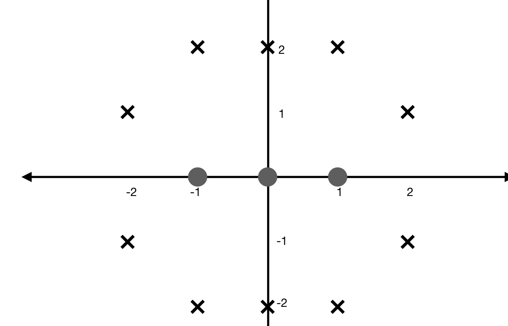
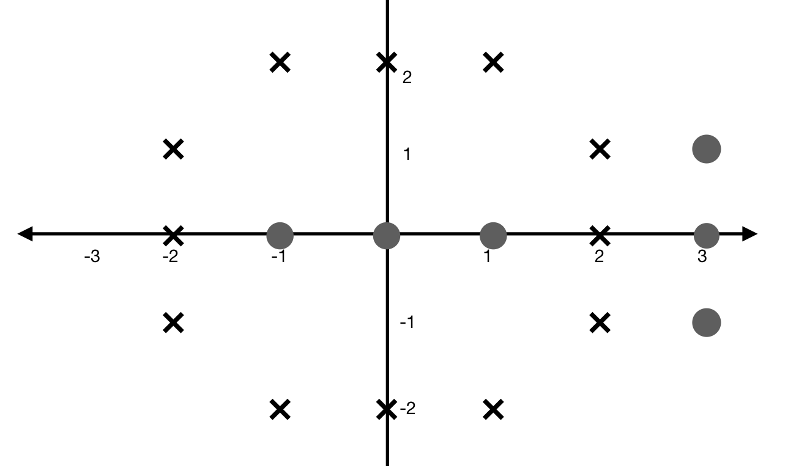
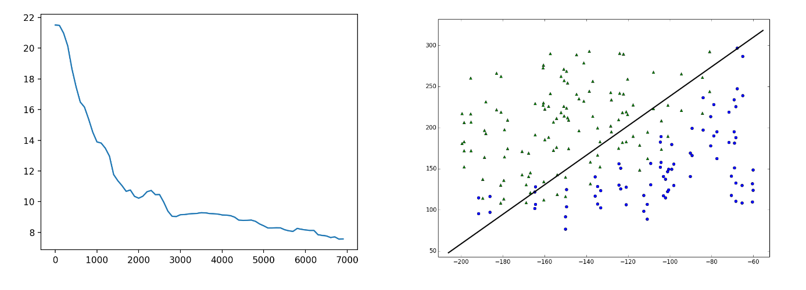

# Implementation of simple percepron and training it with gradient descent optimizer for linear regression task all from scratch 
 
#### part1
##### a
NOR binary logic with perceptron
##### b
Implemention of the gradient descent algorithm for the perceptron and using it to update its weights

#### part 2
##### a madaline classifier 

##### b neural network architecture

* all the wights are set using gradient descent

#### part 3
Implemention of the Perceptron algorithm and runing it on the attached data. Showing the classification
result and error rate per iteration

